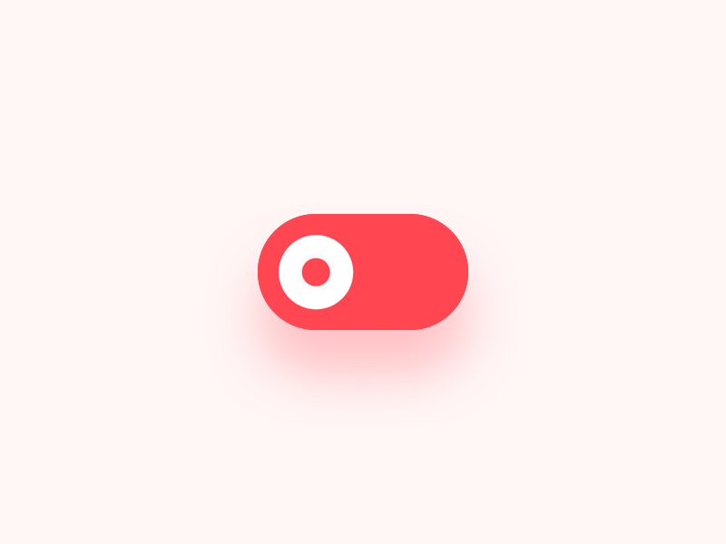
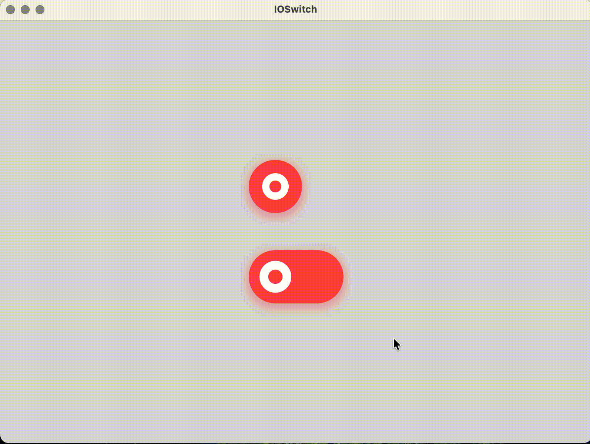

<p align="center">
  
</p>

<p align="center">
  <strong>A beautifully animated switch for Compose Multiplatform.</strong>
</p>

<p align="center">
Create expressive, tactile switches with smooth thumb motion, soft shadows, natural press feedback, and a single API across Android, iOS, Desktop, Web, and Wasm.
</p>

<p align="center">
Designed for apps that value motion, personality, and polished interaction.
</p>

<p align="center">

[](https://central.sonatype.com/artifact/io.github.iprashantpanwar/ioswitch)
[](https://github.com/iprashantpanwar/IOSwitch/actions/workflows/ci.yml)
[](https://iprashantpanwar.github.io/IOSwitch/)
[](https://kotlinlang.org)
[](https://www.jetbrains.com/compose-multiplatform/)
[](LICENSE)

</p>

<p align="center">
  
</p>

---

## 🎯 Inspiration

IOSwitch is inspired by [Oleg Frolov's](https://dribbble.com/Volorf) [Switcher XLIV](https://dribbble.com/shots/5429846-Switcher-XLIV). A calm, playful motion found in modern mobile interfaces.

The goal is simple: make a switch feel less like a static control and more like a small, satisfying interaction.

<p align="center">
  
</p>

---

## 📸 Demo

IOSwitch provides the same expressive switch experience across Compose Multiplatform targets.
<p align="center">
  
</p>

---

# 🚀 Installation

IOSwitch is available on **Maven Central**.

```kotlin
commonMain.dependencies {
    implementation("io.github.iprashantpanwar:ioswitch:<latest-version>")
}
```

Replace `<latest-version>` with the latest published version.

---

# 🧩 Quick Start

```kotlin
@Composable
fun SettingsScreen() {
    var checked by remember { mutableStateOf(false) }

    IOSwitch(
        checked = checked,
        onCheckedChange = { checked = it }
    )
}
```

---

# 🎛 Switch Types

IOSwitch currently provides two visual styles.

### Pill

A compact, rounded switch with a circular thumb.

```kotlin
IOSwitch(
    checked = checked,
    onCheckedChange = { checked = it },
    type = IOSwitchType.PILL
)
```

### Capsule

A wider switch with a more expressive thumb transformation.

```kotlin
IOSwitch(
    checked = checked,
    onCheckedChange = { checked = it },
    type = IOSwitchType.CAPSULE
)
```

---

# ⚙️ Customization

IOSwitch exposes a focused API for customizing appearance and interaction without requiring you to manage the animation system yourself.

Customize:

- Switch type
- Checked and unchecked colors
- Thumb color
- Shadow
- Size and layout
- Haptic feedback
- Enabled state

Example:

```kotlin
IOSwitch(
    checked = checked,
    onCheckedChange = { checked = it },
    colors = IOSwitchDefaults.colors(
        onColor = Color(0xFF48EA8B),
        offColor = Color(0xFFFF4651),
        thumbColor = Color.White
    ),
    shadow = IOSwitchDefaults.shadow(
        radius = 8.dp,
        spread = 4.dp,
        color = Color.Black,
        alpha = 0.2f,
        offset = DpOffset(
            x = 0.dp,
            y = 4.dp
        )
    )
)
```

---

# 📐 Sizing

Use `Modifier` to control the switch size.

```kotlin
IOSwitch(
    checked = checked,
    onCheckedChange = { checked = it },
    modifier = Modifier.width(72.dp)
)
```

IOSwitch preserves the aspect ratio of the selected switch type, preventing stretched or distorted designs.

---

# ✨ Interaction

IOSwitch includes subtle interaction details out of the box:

- Smooth state transitions
- Calm thumb translation
- Thumb morphing
- Press-to-scale feedback
- Ripple feedback
- Optional haptic feedback
- Shape-aware shadows

Disable haptic feedback when needed:

```kotlin
IOSwitch(
    checked = checked,
    onCheckedChange = { checked = it },
    hapticFeedback = false
)
```

For a read-only switch, pass `null` as the change callback:

```kotlin
IOSwitch(
    checked = checked,
    onCheckedChange = null
)
```

---

# 🏗 Architecture

| Component | Responsibility |
|---|---|
| `IOSwitch` | Main public composable |
| `IOSwitchType` | Defines the visual switch variant |
| `IOSwitchColors` | Holds switch colors |
| `IOSwitchShadow` | Holds shadow configuration |
| `IOSwitchDefaults` | Provides default styling |
| `IOSwitchAnimationState` | Coordinates switch animation progress |
| `IOSwitchRenderer` | Draws the selected switch design |
| `IOSwitchInteraction` | Handles taps, ripples, and haptics |

The public API stays small while the rendering, animation, sizing, and interaction responsibilities remain separated internally.

---

# 📚 API Documentation

Browse the latest API documentation:

**https://iprashantpanwar.github.io/IOSwitch/**

---

# 🤝 Contributing

Contributions are always welcome.

If you'd like to improve IOSwitch:

- Report bugs
- Suggest features
- Improve documentation
- Submit pull requests
- Share interaction and animation ideas

Before opening a pull request, please make sure the relevant Compose Multiplatform targets still build successfully.

---

# 🛣 Roadmap

- ✅ Android
- ✅ iOS
- ✅ Desktop
- ✅ JavaScript
- ✅ Wasm
- ✅ Pill switch
- ✅ Capsule switch
- ✅ Custom colors and shadows
- ✅ Ripple and haptic feedback
- ⏳ More switch styles

---

# ❤️ Acknowledgements

Thanks to [Oleg Frolov's](https://dribbble.com/Volorf) for making the Switcher XLIV design. Thanks to the Compose Multiplatform and Kotlin communities for making modern cross-platform UI development possible.

---

# 📄 License

IOSwitch is licensed under the Apache License 2.0.

See the [LICENSE](LICENSE) file for details.
